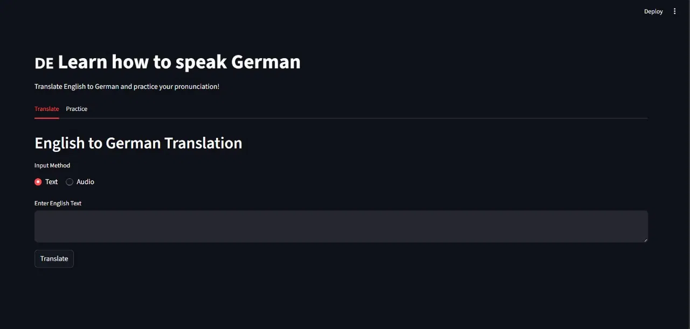
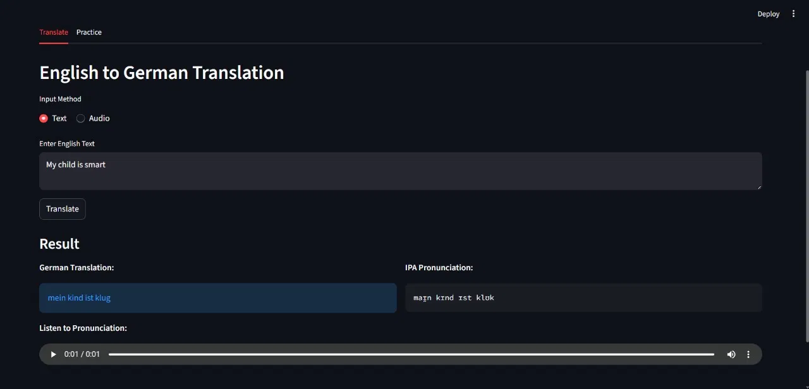
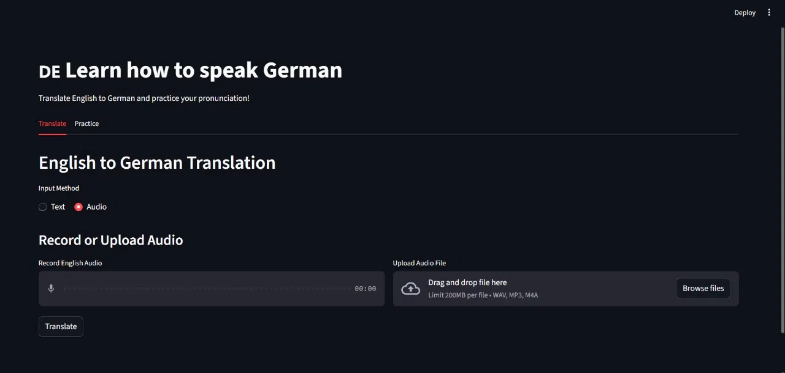
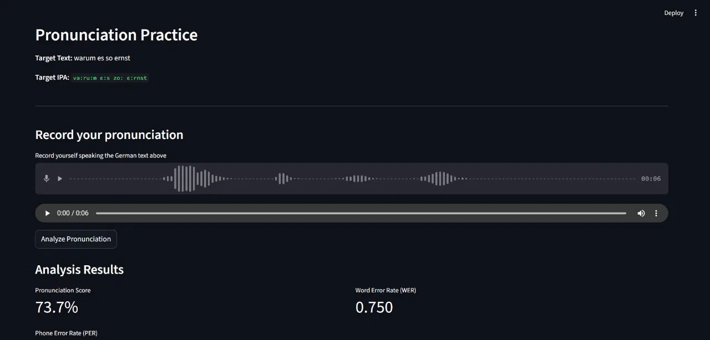

# Automated Language Learning using Deep Neural Networks

An AI-powered language learning system that integrates neural machine translation, speech recognition, pronunciation guidance, and automated evaluation into a single interactive platform.

The system translates **English sentences into German** using a **Transformer-based Neural Machine Translation (NMT)** model and allows users to practice pronunciation with automated scoring and phonetic feedback.

---

## Features

* English → German translation using **Transformer architecture**
* Multilingual speech input using **Whisper ASR**
* German **IPA transcription** for pronunciation guidance
* **Text-to-speech playback** for listening practice
* Pronunciation evaluation using **Word Error Rate (WER)** and **Phone Error Rate (PER)**
* Interactive **Streamlit web interface**

---

## System Architecture

Pipeline:

Audio / Text Input
↓
Whisper Speech-to-Text
↓
Transformer Translation Model
↓
German Output
↓
IPA Generation + Text-to-Speech
↓
User Speech Evaluation (WER / PER)

---

## Dataset

The model was trained on approximately **221,000 English–German sentence pairs** from the **EuroParl / OPUS parallel corpus**.

Dataset preprocessing included:

* Text cleaning and normalization
* Tokenization and vocabulary generation
* Sequence padding and masking
* Train-validation split

---

## Model Details

**Architecture:** Transformer

**Hyperparameters**

* Embedding Dimension: 512
* Attention Heads: 8
* Feedforward Size: 2048
* Max Sequence Length: 30
* Batch Size: 64

**Training Performance**

* Validation Accuracy: **93.33%**
* Validation Loss: **0.41**

---
## Training Notebook

The full model training process is available in `transformer_model_new.ipynb`. 
This notebook includes:

- Data loading and preprocessing
- Vocabulary generation
- Transformer model training
- Loss and accuracy plots
- Translation inference examples

  ---
## Technologies Used

* Python
* TensorFlow / Keras
* Streamlit
* OpenAI Whisper
* Epitran (IPA generation)
* JiWER (WER / PER scoring)
* FFmpeg (audio processing)

---

## Project Structure
```
Automated-Language-Learning/
│
├── app.py                       # Streamlit web interface
├── encoder.py                   # Transformer encoder block
├── decoder.py                   # Transformer decoder block
├── multiHeadAttention.py        # Multi-head attention mechanism
├── scaledDotProduct.py          # Scaled dot-product attention
├── casualMasking.py             # Causal masking for decoder
├── PositionalEmbedding.py       # Positional encoding layer
├── pronounciationIPA.py         # IPA transcription module
├── tokenizer.py                 # Tokenizer utilities
├── model_utils.py               # Model loading and helper functions
├── interact.py                  # Interaction and inference logic
├── live_server.py               # Live demo server
├── live.html                    # Live interface template
├── test.py                      # Testing script
├── source_vocab_re.json         # English vocabulary file
├── target_vocab_re.json         # German vocabulary file
├── transformer_model_new.ipynb  # Model training notebook
│
├── requirements.txt
├── README.md
└── LICENSE
```
---

## Installation

Clone the repository

```
git clone https://github.com/Sarrah-2/Automated-Language-Learning.git
cd Automated-Language-Learning
```

Install dependencies

```
pip install -r requirements.txt
```

---


## Model Files

The trained model files are large and not stored in this repository.

Download them from Google Drive:

- **Model Weights (.h5):** [Download](https://drive.google.com/file/d/1OBWI1_ekf57GzKq-gbjUFY73kmEhQWHM/view?usp=sharing)
- **Training History (.pkl):** [Download](https://drive.google.com/file/d/1KHIiQiKdCuBQPNB12omjIFVRxs53T2pv/view?usp=sharing)

After downloading, place both files **directly in the root project folder** (same level as `app.py`):
```
Automated-Language-Learning/
├── checkpoint.weights.h5   ← place here
├── training_history.pkl    ← place here
├── app.py
└── ...

```
---


## Running the Application

Run the Streamlit application:

```
streamlit run app.py

```

Then open your browser at:

```
http://localhost:8501
```

---

## Example

**Input Sentence (English)**

```
How are you today?
```

**German Translation**

```
Wie geht es dir heute?
```

**IPA Pronunciation**

```
viː geːt ɛs diːɐ̯ hɔʏtə
```

---

## Screenshots

### Home Interface


### Translation with IPA


### Audio Input Mode


### Pronunciation Practice & Scoring


---

## Limitations

* Reduced accuracy for very long sentences
* Whisper ASR performance decreases in noisy environments
* Pronunciation evaluation does not fully capture speech rhythm or prosody

---

## Future Improvements

* Support for additional languages
* Phoneme-level pronunciation feedback
* Mobile-friendly interface
* Cloud deployment for real-time usage

---

## Author

**Sarrah Sadriwala**
B.Tech Electronics and Communication Engineering
The LNM Institute of Information Technology, Jaipur

GitHub: [Sarrah-2](https://github.com/Sarrah-2)
---

## License

This project is licensed under the MIT License.
